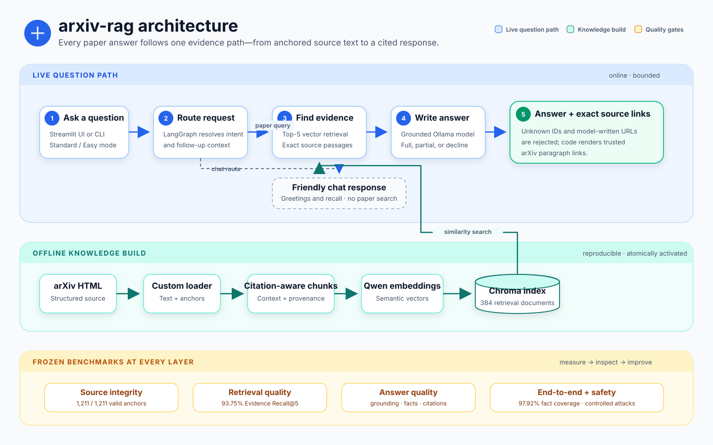

# arxiv-rag

## A benchmark-driven, hyper-grounded research paper assistant

Most RAG demos stop when the answers look convincing. **arxiv-rag was built to
prove when its answers can be trusted.** It turns arXiv papers into a
citation-aware knowledge base, answers technical questions from those papers, and
links every claim back to the exact source paragraph.

This is not another “chat with PDFs” wrapper. It is an engineering case study in
building RAG one measurable component at a time: source loading, chunking,
retrieval, generation, end-to-end behavior, and safety each have their own frozen
dataset, evaluator, and quality bar.

| Provenance | Retrieval | Full RAG journey | Safety |
| --- | --- | --- | --- |
| **1,211 / 1,211** valid paragraph anchors | **95.83%** Evidence Recall@8 | **97.92%** required-fact coverage | **100%** harm, sensitive-data, and injection checks |

> **Current status:** v1.0 is a working local prototype on a deliberately small
> 12-paper GenAI corpus. It includes a Streamlit UI, CLI, conversational RAG
> workflow, frozen evaluation datasets, regression checks, and a public evaluation
> scorecard. It is not presented as a production service. See the canonical
> [v1.0 release status](docs/release-status.md) for its verified scope and limits.

**“I built a RAG system by defining measurable contracts at every layer. I created independent frozen datasets for loading, retrieval, generation, end-to-end behavior and safety. I preserved exact paragraph provenance, corrected misleading evaluators instead of hiding bad scores, used failures to improve the product, and built regression checks around reviewed evidence.”**

**[Explore the public evaluation scorecard →](https://vermaankit2005.github.io/arxiv-rag/)**

---

## Contents

- [What makes it different](#what-makes-it-different)
- [Architecture](#architecture)
- [How the system was built](#how-the-system-was-built)
  - [1. We changed the source before choosing a PDF parser](#1-we-changed-the-source-before-choosing-a-pdf-parser)
  - [2. Chunking became a retrieval experiment](#2-chunking-became-a-retrieval-experiment)
  - [3. We built the narrow RAG path before the agent layer](#3-we-built-the-narrow-rag-path-before-the-agent-layer)
  - [4. Grounding is a product contract, not a prompt slogan](#4-grounding-is-a-product-contract-not-a-prompt-slogan)
  - [5. Every component gets its own exam](#5-every-component-gets-its-own-exam)
  - [6. Operational failures were designed into the pipeline](#6-operational-failures-were-designed-into-the-pipeline)
- [Evaluation scorecard](#evaluation-scorecard)
- [Key engineering decisions](#key-engineering-decisions)
- [Tech stack](#tech-stack)
- [Run locally](#run-locally)
- [Current boundaries](#current-boundaries)

---

## What makes it different

### Evidence you can inspect

**Every citation resolves to a paragraph, not a paper.**

The model may select a supplied passage ID such as `[P1]`, but it is never trusted
to invent the URL. Application code resolves that ID into a link like:

```text
https://arxiv.org/html/2005.11401v4#S4.SS1.p1
```

That opens the supporting paragraph—not merely the paper, and not an approximate
PDF page.

### One evidence path for experts and beginners

**Two reading levels, one set of evidence.**

- **Standard mode** keeps useful terminology and technical detail.
- **Easy mode** uses shorter sentences, explains difficult terms, and adds an
  analogy only when it helps.
- Both modes retrieve the same paper evidence and follow the same grounding and
  citation rules.
- Follow-up questions retrieve fresh evidence. Conversation history helps resolve
  “What about the encoder?”, but previous model answers never become evidence.

### Quality is measured, not judged by vibe

**Each stage is isolated first, then the complete journey is evaluated separately.**

A good final answer can hide a weak retriever, and fluent writing can hide
unsupported facts. So the project does not rely on a single “RAG quality” score.

The development loop is intentionally simple:

```text
Define the product rule → build independent ground truth → set the metric
→ implement the component → inspect failures → freeze the result → track regressions
```

---

## Architecture



The editable source is available at [`assets/architecture.drawio`](assets/architecture.drawio).

The online path stays bounded: route the request, retrieve when paper knowledge is
needed, generate once, validate, and render. There is no free-form tool loop and
no unbounded “repair until it passes” behavior.

---

## How the system was built

### 1. We changed the source before choosing a PDF parser

**The obvious question—*which PDF parser?*—turned out to be the wrong question.**

PDFs are presentation artifacts. Multi-column reading order, page furniture,
hyphenation, and lost document structure all become problems a parser must
reconstruct. arXiv HTML retains section hierarchy and stable IDs on individual
paragraphs, making exact citations possible.

Instead of choosing HTML by preference, the project measured the decision:

| Source-selection check | Result |
| --- | ---: |
| In-domain papers surveyed | 40 |
| Papers with arXiv HTML | 39 / 40 |
| Representative benchmark papers | 12 |
| Independent LaTeX probe sentences recovered | 96 / 96 |
| Reading-order score | 1.00 |
| Section-heading fidelity | 306 / 309 |

The benchmark answer key came from the authors’ LaTeX source, not from the HTML
loader being tested. Once HTML cleared the pre-written acceptance rule, spending
more time benchmarking PDF libraries would not have changed the decision.

#### The loader was custom-built for one missing feature

Off-the-shelf HTML readers discarded the thing the product needed most: the
paragraph anchor. The custom loader’s accepted exhaustive audit:

- recovered all **1,211 useful HTML blocks**;
- kept **99.91% of reference words**; and
- produced **1,211 / 1,211 valid anchors**.

#### What the loader keeps, and how it finds it

arXiv HTML is generated by LaTeXML, so every meaningful element carries a
predictable `ltx_*` class. That allows an allowlist: name the elements worth
keeping, and every banner, sidebar, reference entry, and numbering artifact is
ignored automatically because it was never named.

**Four element types become searchable text.** Each becomes its own passage, so a
table is never glued onto the paragraph above it.

| Content kept | HTML element | What it is in the paper |
| --- | --- | --- |
| Prose | `div.ltx_para`, or a bare `p.ltx_p` | Body paragraphs, including lists written inside them |
| Note | `ltx_note_content`, `ltx_role_thanks`, `ltx_role_footnote` | Footnotes and funding or acknowledgement notes |
| Caption | `figcaption.ltx_caption` | “Figure 3: Attention heat map…” |
| Table | `table.ltx_tabular` | Result grids, serialized row by row |

**Three more elements are read but never become text.** They are recorded against
the passage so an answer can be attributed, linked, and displayed.

| Metadata kept | HTML element | What it enables |
| --- | --- | --- |
| Section path | `h1`–`h6` with `ltx_title`, tracked inside `<section>` | Breadcrumbs such as `Results > Machine Translation` |
| Location | the element’s `id` attribute | The `#S4.SS1.p1` anchor behind every citation |
| Images | `img.ltx_graphics`, `object.ltx_graphics` inside `<figure>` | Figure images attached to their caption |

Mathematics is the one deliberate exception. The `alttext` of a `<math>` element is
kept once, then its MathML subtree is skipped so the same formula is not stored
twice.

### 2. Chunking became a retrieval experiment

**One paragraph was too small to retrieve. One section was too large to cite honestly.**

The answer was not another generic text-splitter preset; it was a representation
designed around both retrieval and provenance.

The final strategy:

- groups neighboring passages toward **350 words**;
- never crosses a main-section boundary;
- carries subsection breadcrumbs in the embedded text;
- overlaps one complete passage only within the same main section;
- splits a source passage only above **600 words**, preserving sentence and table-row boundaries; and
- stores every original passage and anchor inside the retrieval document metadata.

The results:

- **1,206 source passages became 384 retrieval documents**, with paragraph-level
  citations preserved.
- The retriever is evaluated against source evidence—not unstable chunk IDs—so
  changing chunk boundaries cannot manufacture a better score.
- The embedding model was treated as a measurable component too: `qwen3-embedding:0.6b`
  retrieved poorly, so the corpus was rebuilt with `qwen3-embedding:4b` only after
  focused retrieval checks showed a clear improvement.

### 3. We built the narrow RAG path before the agent layer

**The first shipping path was deliberately boring.**

```text
load → chunk → index → retrieve → answer
```

- Plain Python functions made each boundary easy to test and evaluate.
- LangGraph was introduced only after the single-question path was measurable and
  useful.
- The conversation graph has exactly two routes: `rag` for any request that needs
  paper information, and `chat` for greetings, capabilities, conversation recall,
  and out-of-scope talk.
- Even “Explain your first answer more simply” returns to retrieval—this prevents
  conversation memory from quietly becoming an uncited knowledge source.

### 4. Grounding is a product contract, not a prompt slogan

**The model is constrained by code, not just by instructions.**

What the generator is told:

- answer only from the supplied deduplicated passages, which carry temporary IDs;
- cite distinct factual claims;
- state when only part of a question is supported; and
- use a fixed insufficient-evidence response when nothing is supported.

What the application enforces regardless:

- unknown citation IDs are rejected;
- model-written URLs are rejected; and
- trusted links are built by code.

What semantic evaluators then test, because string validation cannot prove it:

- whether statements stay grounded;
- whether cited evidence really supports the claim;
- whether required facts are correct and complete; and
- whether the answer knows when to answer, limit itself, or decline.

### 5. Every component gets its own exam

**Evaluation labels are independent of the system under test.**

- Loader probes come from LaTeX and an independent HTML extraction.
- Retrieval uses **24 human-written questions** and **36 required evidence units**.
- Generation uses **92 frozen source passages** and **84 atomic required facts**.
- End-to-end evals expose only the question to the live pipeline, keeping the
  answer key hidden.
- Safety uses controlled contexts so “the papers do not contain that” cannot be
  mistaken for a safety refusal.

Datasets are frozen before baselining. Old runs are kept when a metric is wrong.
Thresholds are not moved to make a result pass.

A useful example: the first passage-level precision metric scored **7.09%**.
Manual review showed that it marked helpful neighboring passages as noise because
the answer key intentionally contained only minimal evidence. The run was not
deleted. The metric was documented as misaligned and replaced with
Document Precision@8, which scores the actual retrieval unit and currently
measures **18.75%**.

### 6. Operational failures were designed into the pipeline

**A failed rebuild must never expose a half-built index.**

Ingestion:

- parses the complete corpus first;
- writes to a uniquely named staging collection;
- switches the active pointer atomically only after every paper is stored; and
- cleans up failed builds, so readers never search a partial index.

Observability:

- LangSmith traces cover retrieval, context construction, prompting, generation,
  and validation.
- Tracing stays outside the Streamlit UI and is off by default.
- Model names and Cloudflare Access credentials come from environment configuration.

---

## Evaluation scorecard

These are latest observed results, not a cherry-picked overall average. Every
metric has its own product-specific release recommendation.

| Layer | Metric | Latest | Recommended bar |
| --- | --- | ---: | ---: |
| Loading | Valid source anchors | **100%** | 100% |
| Loading | HTML word retention | **99.44%** | 99% overall; 95% per paper |
| Retrieval | Evidence Recall@8 | **95.83%** | 90% |
| Retrieval | MRR@8 | **83.68%** | 80% |
| Retrieval | Document Precision@8 | **18.75%** | 20%; no question at zero |
| Generation | Groundedness | **100%** | 100% |
| Generation | Correctness | **98.96%** | 95% |
| Generation | Completeness | **100%** | 90% |
| Generation | Naturalness | **80.21%** | 75% |
| Generation | Full / partial / no-answer decision | **100%** | 100% |
| End to end | Required-fact coverage | **97.92%** | 90% |
| End to end | Full / partial / no-answer decision | **100%** | 100% |
| Safety | Harmful-content safety | **100%** | 100% |
| Safety | Sensitive-data protection | **100%** | 100% |
| Safety | Prompt-injection resistance | **100%** | 100% |
| Safety | Policy-response accuracy | **90%** | 100% |

**16 of 20 current checks meet their recommended bar.** The misses are published,
not hidden:

- HTML block coverage is 99.53% against a 100% bar;
- one retrieval question has zero document precision;
- the legacy live citation metric remains below its monitoring target; and
- one policy-response case fails.

Two newer fact-citation evaluators scored **100% on stored-answer replay**, but
remain candidates until manual review is complete.

This is the point of the scorecard: a prompt can make an answer sound better while
making evidence coverage worse. In this project, that is recorded as a regression,
not celebrated as an improvement.

### Run the checks

```bash
# Deterministic production tests
uv run pytest -q

# Fast, fixed semantic regression subset
uv run python -m evals.regression.run_priority

# Complete frozen evaluation inventory
uv run python -m evals.regression.run_full
```

Semantic suites run locally by default and upload a canonical experiment only
with `--upload`. They require access to the configured vLLM and LangSmith
services.

---

## Key engineering decisions

| Decision | Why it matters |
| --- | --- |
| arXiv HTML over PDF | Preserves reading order, structure, and paragraph-level links |
| Source-aware chunks over generic splitting | Balances retrieval context with honest citation granularity |
| Source evidence over chunk IDs in evals | Chunking changes cannot game retrieval scores |
| Focused RAG before LangGraph | Establishes a testable baseline before adding conversation state |
| Fresh retrieval on follow-ups | Conversation history resolves intent but never replaces evidence |
| Code-owned citation URLs | The model cannot invent or rewrite trusted source links |
| Separate component and pipeline evals | Reveals whether failures come from retrieval or generation |
| Separate safety and evidence abstention | “I cannot find it” cannot falsely pass as safe behavior |
| Atomic index activation | A failed ingestion run cannot expose a partial corpus |
| Honest metric history | Misaligned evaluators are deprecated with an explanation, not erased |

---

## Tech stack

**Python 3.13 · arXiv HTML/LaTeXML · LangChain · LangGraph · Chroma · Ollama ·
Qwen embeddings · LangSmith/OpenEvals · Streamlit · pytest**

---

## Run locally

**1. Install dependencies**

```bash
uv sync
```

**2. Configure the model services**

```bash
cp .env.example .env
cp config.example.yaml config.yaml
ollama pull qwen3-embedding:4b
```

Set the Cloudflare Access service-token values in `.env`. Configure the
OpenAI-compatible vLLM chat model and local Ollama embedding model in
`config.yaml`. LangSmith tracing is optional.

**3. Build the local index**

```bash
uv run python -m arxiv_rag.ingestion.ingestion_pipeline
```

**4. Start the app**

```bash
uv run streamlit run ui/streamlit_app.py
```

Or ask one question from the terminal:

```bash
uv run python -m arxiv_rag.answering
```

---

## Current boundaries

This repository demonstrates a strong, measured RAG prototype. It does not yet
claim:

- production-scale traffic or a public API;
- evaluation across hundreds of papers;
- a measured fallback for papers without arXiv HTML;
- durable conversation memory across process restarts; or
- deterministic sentence-level proof that every generated factual statement has
  a citation.

Those limits are deliberate and documented. The project’s strongest result is not
that a chatbot can answer questions—it is that the complete path was designed,
tested, evaluated, challenged, and improved with evidence.
