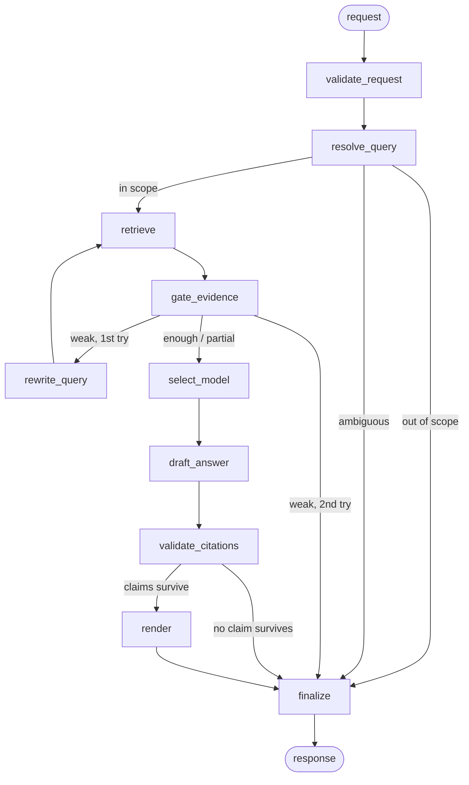

# The graph — overview only

**Purpose of this document:** one page that shows where the pieces eventually
live, so that when we build a component we know what it feeds and what feeds it.

**What this document deliberately does NOT contain:** the state object, Pydantic
schemas, retry counts, timeouts, or budgets. Those are decided per component,
with data, when that component is built. A schema written today is a guess.

---

## The map

## Nodes

| # | Node | Decides | Who decides | Deterministic? |
|---|------|---------|-------------|----------------|
| 1 | `validate_request` | is this request well-formed and within limits | code | yes |
| 2 | `resolve_query` | scope, intent, filters, is it ambiguous | model | no |
| 3 | `retrieve` | which passages are candidates | search engine | yes |
| 4 | `gate_evidence` | is this enough to answer, fully or partly | code first, model if unclear | mixed |
| 5 | `rewrite_query` | one better query, once | model | no |
| 6 | `select_model` | fast or strong | code, from features | yes |
| 7 | `draft_answer` | the claims and which passage supports each | model | no |
| 8 | `validate_citations` | does the cited passage actually support the claim | model | no |
| 9 | `render` | presentation style only | code / model | mixed |
| 10 | `finalize` | the single terminal response | code | yes |

## Edges worth naming

Only three edges are conditional, and each encodes a product rule:

- **`resolve_query` → finalize** — refusing out-of-scope and asking for
  clarification are product behaviours, not error handling.
- **`gate_evidence` → rewrite_query → retrieve** — the *only* loop in the
  system, and it runs at most once. This is the line between a bounded graph
  and an autonomous agent.
- **`validate_citations` → finalize** — an unsupported claim is deleted, not
  repaired. No repair loop.

## The one sentence that matters

**The model decides content; code decides topology.** Intent, sufficiency,
wording, and claims come from the model. Which node runs next, how many times,
and when to stop come from code. Every principle in `PRINCIPLES.md` depends on
that split holding.

## Honest status

Nothing in this diagram is built. It is a map, not a plan — we will build the
data path first (load → chunk → retrieve → answer) as plain functions, and the
graph gets built only when the branches above actually exist in the code and a
long `if/else` has become unreadable. If we reach the end and some node never
earned its place, we delete it from this diagram and say why.
